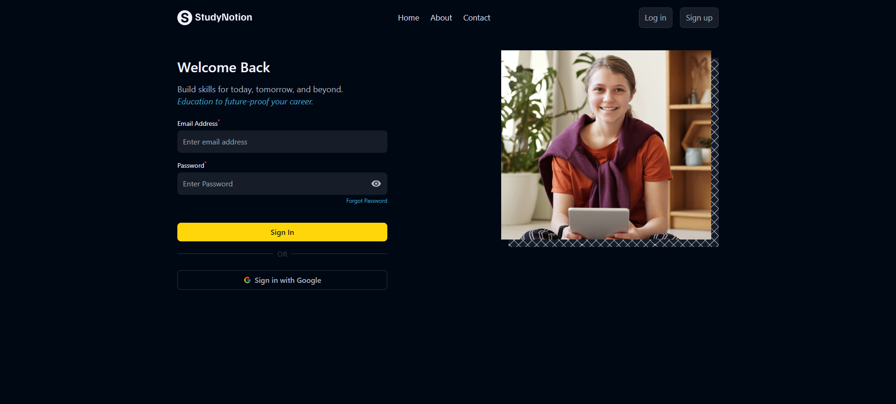
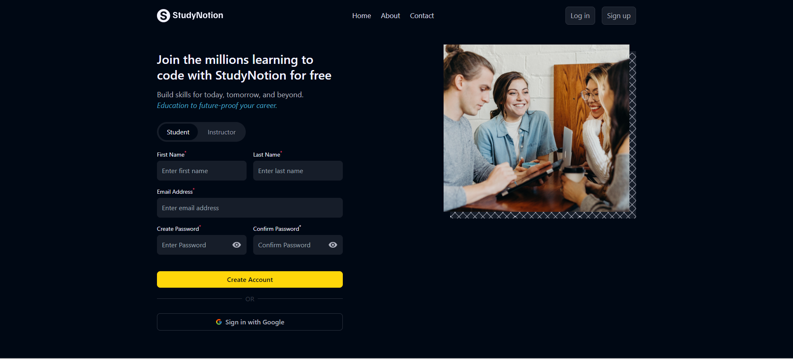

# React Login and Sign-up Form with Dashboard

## Description

A React JS project featuring a login and sign-up form with additional details for students and instructors. The project utilizes Tailwind CSS for styling. It includes a dashboard accessible only to logged-in users, with customized buttons based on the user's login state.

## Features

- **Login Form:** Users can log in with their credentials.
- **Sign-up Form:** Users can sign up with additional details for students and instructors.
- **Dashboard:** Accessible only to logged-in users, with customized buttons based on login state.

## Form Preview

  
  

## Technologies Used

- HTML
- React JS
- Tailwind CSS
